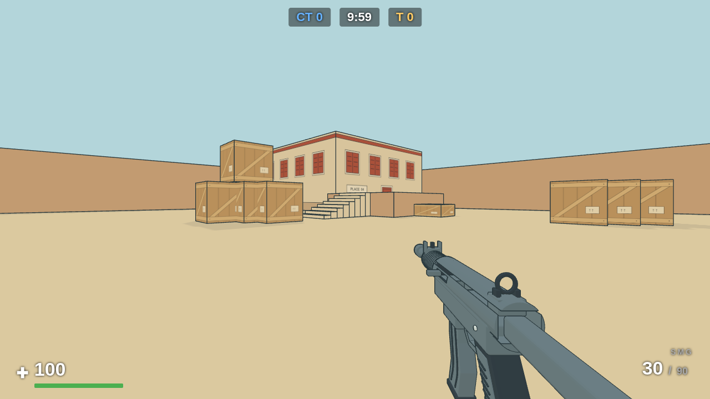
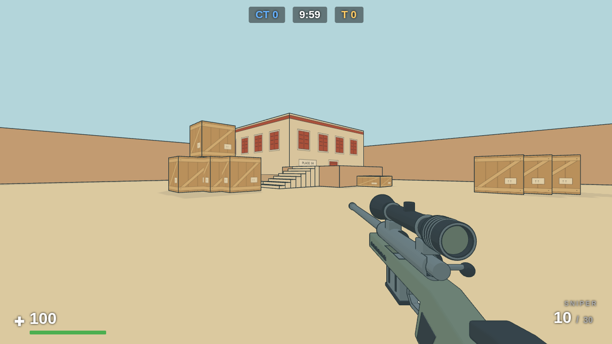
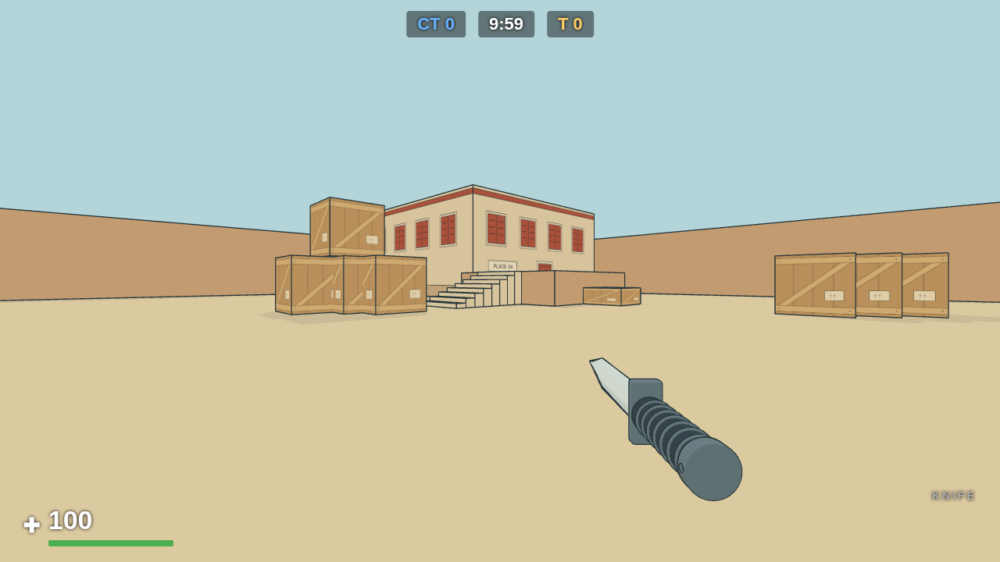
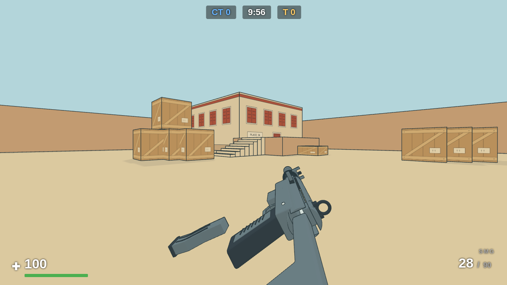
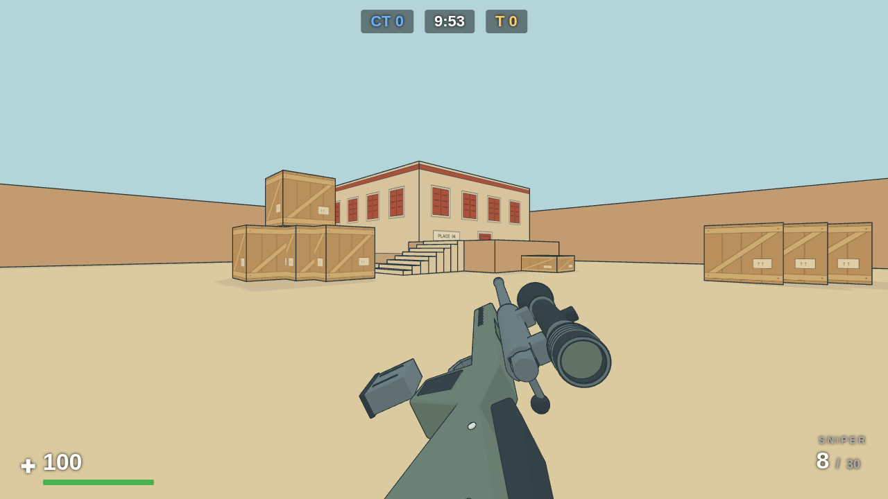

# First-person weapon assets

Editable sources under `assets/source/`: `shotgun.blend`, `revolver.blend`,
`pistol.blend`, `smg.blend`, `sniper.blend`, and `knife.blend`.
Runtime exports live under `public/assets/` with the matching `.glb` names. The
game retains procedural maps, bot weapon silhouettes and synthesized audio. Blender is an
asset-authoring dependency, never a requirement for normal builds or deployment.

## Headless workflow

```sh
npm run assets:export
npm run assets:check
npm run build
```

`BLENDER=/absolute/path/to/blender` overrides the executable. Export opens the
edited sources, preserves them, writes GLB, validates the result, then records
source/output/export-script SHA-256 hashes and settings in
`assets/weapons-manifest.json`. Commit sources, GLBs and manifest together.
`assets:check` verifies all six committed GLBs without Blender.
The exporter disables audio via `ALSOFT_DRIVERS=null` for headless Linux machines.

The sources are modeled in game coordinates: metres, Y up, -Z forward. Blender's
native Z-up convention is deliberately not used here. Export uses
`export_yup=False` to avoid rotating these coordinates a second time. Apply mesh
transforms before export. No textures or animation clips are needed.

## Optional live connection

Tested: Blender 5.2.0 LTS, blender-mcp 1.9.1, add-on protocol 5.
The bridge was verified using MCP scene inspection and viewport capture. It
requires Blender's UI event loop and explicitly refuses `--background`. Following
the headless workflow preference, it is installed but not required or started by
any repository command. Use batch Python for normal work and browser screenshots
for final rendering checks. An interactive/virtual-display session is optional.

Machine setup (outside the repository):

```sh
BLENDERMCP_ADDONS_DIR="$HOME/.config/blender/5.2/scripts/addons" \
  uvx --python 3.11 blender-mcp==1.9.1 install-addon
codex mcp add blender --env BLENDER_MCP_DISABLE_TELEMETRY=1 -- \
  /absolute/path/to/uvx --python 3.11 blender-mcp==1.9.1
```

Enable “Interface: MCP for Blender” in Blender preferences. Disable **Allow
Telemetry** before starting its local server. The bridge defaults telemetry on;
initial setup verification exposed this and uploaded its first captures before
both the add-on preference and Codex environment were disabled. No external
asset-provider integrations are enabled. Restart the Codex task/app if newly
registered tools do not appear in an existing session.

The installed system Blender reports an OCIO 2.5 configuration / 2.4 library
mismatch and uses fallback color management. Geometry export is verified; final
palette approval uses the browser's cel renderer, not Blender's viewport colors.

## Authored weapons

The weapon exporter preserves named grip and loading markers and creates
pivot groups for the pump/action bars, revolver crane/cylinder, and hammer.
It converts curves/modifiers and merges siblings by material in the disposable
export scene. The edited source is never regenerated by the export command.
`create-weapon-previews.py` is the initial design generator and **overwrites**
both sources; use Blender to edit the approved files instead.

The revolver's hammer was lowered 5 mm from its first approved shape so it stops
standing over the sight line; see the sight-picture section in
`docs/visuals-plan.md` for the measurements. That edit was a one-off `bpy`
translation of the `Hammer` mesh, not a pipeline step — the `.blend` is the
source of truth afterwards.

The revolver's six chambers are bored straight through, so the cylinder used to
read as an empty gun — six black holes, and daylight through the frame window.
Each chamber now holds a seated cartridge: a brass case stopping 8 mm short of
the chamber mouth, a rim standing 1.8 mm proud of the rotor's rear face, and a
dark primer. This is static geometry, not an ammo display; the rounds never
disappear as the cylinder empties. Added by the same one-off `bpy` route as the
hammer drop, but unlike the hammer it is **also** in `create-weapon-previews.py`
(`loaded_chambers()`, shared by both so they cannot drift), so re-running the
design generator will not silently regress it. The parts are collected by their
`Chamber ` name prefix into `mechanism_rotor` at export, which is what makes them
index with the cylinder and swing out with the crane; `validateWeaponGlb` asserts
the rotor still owns brass geometry so a future re-export cannot drop them. They
reuse the existing `Brass` and `Recess / rubber` materials — a new material would
collide when the exporter strips `.NNN` suffixes and fail the palette assertion.

The ordinary build serves these files from Vite's configured base URL; startup
loads each once before enabling Deploy. A missing or incompatible weapon asset
is a visible startup error.

Presentation uses those markers in body space. Shotgun reloads roll the receiver
to expose the underside loading port and feed shells into it; revolver reloads
swing the cylinder out about its authored crane pivot and feed the exposed
chamber, indexing between rounds. TypeScript game clocks still own every
ammunition transfer, cancellation and readiness decision. No exported animation
or model transform controls gameplay timing.

## Review

Run `scripts/weapon-assets-check.mjs` against a dev/production server to exercise
missing/corrupt assets, one-load startup, viewmodel clone independence, and
respawn. Use `scripts/weapon-animation-check.mjs <output-dir> shotgun revolver`
for input-driven pose captures, pause, per-round transfer and interruptions.
Test production preview as well. Sources and runtime assets are small enough to
commit directly; Blender backup files and temporary render output are excluded.

## Pistol

The pistol exports independent slide and magazine assemblies. The fixed
`reload_port` and `magazine_out` markers define the magazine travel vector;
its downward/backward slope matches the grip cavity. The Blender generator
checks the beveled magazine against the cut grip at rest and at 101 extraction
positions. The floorplate sits beneath the grip without a rear overhang.

The hands-free reload rolls about the receiver to keep magazine travel visible.
A partial reload swaps the magazine; an empty reload also racks the slide after
seating. Existing game clocks own ammunition and cancellation. The source has
no baked animation clips. Generate review footage with:

```sh
CS_SMOKE_BASE=http://127.0.0.1:5189 node scripts/weapon-reload-video.mjs /tmp/pistol-review pistol
```

The pistol design generator is `scripts/assets/create-pistol-preview.py` and
explicitly overwrites only the pistol source. Normal `assets:export` preserves
all edited sources. The older two-weapon generator still overwrites only its
shotgun and revolver sources.

## Handgun sight attachment and alignment

The edited pistol source extends the front blade and rear sight base down into
its slide, preserving the aiming heights. The revolver source has a notched rear
sight and a front blade raised to the existing 37 mm ADS reference. Its front
blade remains seated on the barrel rib; the lowered hammer is preserved. These
are manual source edits, so the initial design generators will overwrite them.
Runtime ADS offsets and mechanism animations are unchanged.

The sight tests now probe the pistol supports where sky gaps used to appear and
raycast through the revolver notch to its front blade throughout firing. The
revolver's expected near geometry in the upper aim cone is now its aligned rear
shoulders, rather than the old low sights. The old obstructing hammer mutation
still fails the check. Sky-background ADS captures verify the visible result.

## SMG, sniper rifle and knife

All six first-person weapons now load authored GLBs. The SMG and sniper use
fixed well/extraction markers for their detachable magazines, with independent
SMG action and sniper bolt assemblies. The knife uses grip and blade-tip markers
without firearm-only loading markers. See
[`remaining-weapons.md`](../assets/source/remaining-weapons.md) for modeling,
rebuild commands and geometry-clearance checks.

The first-person procedural weapon builders have been removed. Loose reload
cartridges remain procedural effects. Weapon stats, shot/reload clocks, scope
overlay behavior, sounds and bot-held silhouettes retain their existing behavior.

Run all-weapon animation checks (default when no IDs are supplied):

```sh
CS_SMOKE_BASE=http://127.0.0.1:5193 node scripts/weapon-animation-check.mjs /tmp/weapon-review
CS_SMOKE_BASE=http://127.0.0.1:5193 node scripts/weapon-assets-check.mjs
```

The asset checks cover missing/corrupt files and one-load startup for all six
assets. Unit checks exercise exported contracts, independent clones, magazine
paths, action restoration and aiming visibility. Runtime palette and framing
are reviewed in the browser; the studio renders use Workbench material colors.

### Runtime review captures

Captured in the ligne-claire renderer at 1280 × 720. Regenerate with the browser
animation check above when models or presentation change.

| SMG | Sniper | Knife |
| --- | --- | --- |
|  |  |  |

The rifle reload roll keeps the extracted magazines visible:

| SMG reload | Sniper reload |
| --- | --- |
|  |  |
