# First-person weapon assets

Editable sources under `assets/source/`: `shotgun.blend`, `revolver.blend`,
`pistol.blend`, `smg.blend`, `sniper.blend`, `knife.blend`, `ak47.blend`, `sawnOff.blend`,
`longbow.blend`, and `armingSword.blend`.
Runtime exports live under `public/assets/` with the matching `.glb` names. The
game retains procedural maps and synthesized audio — bots hold the same
authored weapon models as the player, mounted third-person on their aim
hinge (core/botWeaponModels.ts). Blender is an
asset-authoring dependency, never a requirement for normal builds or deployment.

## Headless workflow

```sh
npm run assets:export
npm run assets:check
npm run build
```

`BLENDER=/absolute/path/to/blender` overrides the executable. Export opens the
edited sources, preserves them, writes GLB, validates the result, then records
source/output/export-script SHA-256 hashes and settings in
`assets/weapons-manifest.json`. Commit sources, GLBs and manifest together.
`assets:check` verifies all ten committed GLBs without Blender.
The exporter disables audio via `ALSOFT_DRIVERS=null` for headless Linux machines.

The manifest also records `gltfAddon` (e.g. `"5.2.40"`), the Khronos glTF
Blender I/O add-on version, which Blender's own version string does not
distinguish. That string is embedded in every GLB's `asset.generator`, so
export strips the version tail to `Khronos glTF Blender I/O` before hashing —
inputs differing only by exporter version re-export byte-identical, and
`assets:check` fails on mixed or unnormalized generators with a named error
instead of a bare hash mismatch (issue #112). An add-on bump that changes
anything else still moves the output hashes — re-export to refresh them
rather than reading a moved hash as corruption.

The sources are modeled in game coordinates: metres, Y up, -Z forward. Blender's
native Z-up convention is deliberately not used here. Export uses
`export_yup=False` to avoid rotating these coordinates a second time. Apply mesh
transforms before export. No textures or animation clips are needed.

## Real-world size

The first builds were drawn oversized: the pistol (0.30 m) nearly as long as the
revolver, the SMG (0.85 m) longer than any real SMG, and the revolver's
cylinder 78 mm across, about twice a real one. `scripts/assets/real-size.py`
scales each source uniformly about its origin, so proportions, markers and
pivots all keep their relationships and the sight line scales with the gun:

| Weapon | Scale | Overall length | Real reference |
| --- | --- | --- | --- |
| pistol | 0.70 | 0.21 m | full-size service pistol, 0.19–0.22 m |
| revolver | 0.85 | 0.32 m | 7.5 in .44 Magnum (barrel lengthened after the pass) |
| sawnOff | 0.80 | 0.39 m | pistol-grip sawn-off; 18.4 mm (12-gauge) bore |
| smg | 0.80 | 0.68 m | MP5 / UMP, 0.68–0.69 m |
| shotgun | 0.92 | 0.99 m | 18–20 in pump gun |
| ak47 | 0.935 | 0.88 m | AKM, 0.88 m |
| sniper | — | 1.14 m | already real-sized |
| knife | — | 0.30 m | already real-sized (issue #143) |
| longbow | — | 1.91 m | drawn at real size: English war bow, 1.82 m nock to nock |
| armingSword | — | 0.93 m | drawn at real size: Oakeshott type XII, 0.76 m blade |

The revolver's cylinder is additionally trimmed to 0.75 of its radius about its
own axis, so it stays round and keeps indexing. It comes out at 50 mm with
11.5 mm chambers: .44 Magnum proportions, for the one-headshot sidearm. Its
barrel was then lengthened 42 mm to 7.5 in, the long-range hand-cannon length
that fits that role. In the source this was a one-off `bpy` stretch of the
barrel, top rib and underlug, with the front sight and `Muzzle` marker moved
along. In the generator it is `BARREL_EXTENSION`, so a regenerated revolver
keeps it. The ejector rod stays cylinder-length, as on the real guns. Two steel fills close the frame
window above and below it. The loading marker moved into the source as
`Reload.Chamber`, so the exporter no longer hard-codes a chamber position that
the trim would have left behind.

The script records the applied factor in the scene (`Real-size scale`), so a
second run changes nothing. The design generators call the same
`rescale_to_real_size()` before saving, so a regenerated source comes out at
the same size. Millimetre figures elsewhere in this file that predate the pass
(the 5 mm hammer drop, the 37 mm ADS reference) describe the geometry as it was
drawn and are 0.85× that in the shipped revolver.

Sizes the code carries alongside the assets were scaled with them:
`weaponModels.ts`'s sight lines and loose cartridges, the per-weapon action
stroke in `weaponAssets.ts:ACTION_TRAVEL`, and the shell paths in the
shotgun, revolver and sawn-off presentations. `weaponRig.test.mjs` pins every
weapon's length to its real range.

## First-person hold

Every firearm viewmodel is placed by one rule rather than per-weapon offsets
(`weaponModels.ts`, solved by `sim/viewmodelHold.ts:hipHold`). At the hip its
`grip_right` marker sits on one shared hand point, and the bore is turned to
cross the crosshair 3 m out, so each weapon shows at its real size with the
same inward cant. Aiming unwinds that cant about the hand, then puts the sight
line on the view axis. A long gun whose butt would still end inside the frame
at the hip (the SMG's short stock) is drawn back along its bore until its last
5 cm clears the bottom edge with view bob, by a measured amount
(`sim/viewmodelHold.ts:slideToClear`), which keeps it on the same aim point.
Long guns are shouldered with the butt on the eye plane,
and handguns sit with their origin 0.44 m out. The knife keeps its own
hand-derived hold (issue #143). `scripts/viewmodel-shots.mjs` captures hip,
ADS and reload views of all eight weapons for comparison.

## Optional live connection

Tested: Blender 5.2.0 LTS, blender-mcp 1.9.1, add-on protocol 5.
The bridge was verified using MCP scene inspection and viewport capture. It
requires Blender's UI event loop and explicitly refuses `--background`. Following
the headless workflow preference, it is installed but not required or started by
any repository command. Use batch Python for normal work and browser screenshots
for final rendering checks. An interactive/virtual-display session is optional.

Machine setup (outside the repository):

```sh
BLENDERMCP_ADDONS_DIR="$HOME/.config/blender/5.2/scripts/addons" \
  uvx --python 3.11 blender-mcp==1.9.1 install-addon
codex mcp add blender --env BLENDER_MCP_DISABLE_TELEMETRY=1 -- \
  /absolute/path/to/uvx --python 3.11 blender-mcp==1.9.1
```

Enable “Interface: MCP for Blender” in Blender preferences. Disable **Allow
Telemetry** before starting its local server. The bridge defaults telemetry on;
initial setup verification exposed this and uploaded its first captures before
both the add-on preference and Codex environment were disabled. No external
asset-provider integrations are enabled. Restart the Codex task/app if newly
registered tools do not appear in an existing session.

The installed system Blender reports an OCIO 2.5 configuration / 2.4 library
mismatch and uses fallback color management. Geometry export is verified; final
palette approval uses the browser's cel renderer, not Blender's viewport colors.

## Authored weapons

The weapon exporter preserves named grip and loading markers and creates
pivot groups for the pump/action bars, revolver crane/cylinder, and hammer.
It converts curves/modifiers and merges siblings by material in the disposable
export scene. The edited source is never regenerated by the export command.
`create-weapon-previews.py` is the initial design generator and **overwrites**
both sources; use Blender to edit the approved files instead.

The revolver's hammer was lowered 5 mm from its first approved shape so it stops
standing over the sight line; see the sight-picture section in
`docs/visuals-plan.md` for the measurements. That edit was a one-off `bpy`
translation of the `Hammer` mesh, not a pipeline step — the `.blend` is the
source of truth afterwards.

The revolver's six chambers are bored straight through, so the cylinder used to
read as an empty gun — six black holes, and daylight through the frame window.
Each chamber now holds a seated cartridge: a brass case stopping 8 mm short of
the chamber mouth, a rim standing 1.8 mm proud of the rotor's rear face, and a
dark primer. This is static geometry, not an ammo display; the rounds never
disappear as the cylinder empties. Added by the same one-off `bpy` route as the
hammer drop, but unlike the hammer it is **also** in `create-weapon-previews.py`
(`loaded_chambers()`, shared by both so they cannot drift), so re-running the
design generator will not silently regress it. The parts are collected by their
`Chamber ` name prefix into `mechanism_rotor` at export, which is what makes them
index with the cylinder and swing out with the crane; `validateWeaponGlb` asserts
the rotor still owns brass geometry so a future re-export cannot drop them. They
reuse the existing `Brass` and `Recess / rubber` materials — a new material would
collide when the exporter strips `.NNN` suffixes and fail the palette assertion.

The ordinary build serves these files from Vite's configured base URL; startup
loads each once before enabling Deploy. A missing or incompatible weapon asset
is a visible startup error.

Presentation uses those markers in body space. Shotgun reloads roll the receiver
to expose the underside loading port and feed shells into it; revolver reloads
swing the cylinder out about its authored crane pivot and feed the exposed
chamber, indexing between rounds. TypeScript game clocks still own every
ammunition transfer, cancellation and readiness decision. No exported animation
or model transform controls gameplay timing.

## Review

Run `scripts/weapon-assets-check.mjs` against a dev/production server to exercise
missing/corrupt assets, one-load startup, viewmodel clone independence, and
respawn. Use `scripts/weapon-animation-check.mjs <output-dir> shotgun revolver`
for input-driven pose captures, pause, per-round transfer and interruptions.
Test production preview as well. Sources and runtime assets are small enough to
commit directly; Blender backup files and temporary render output are excluded.

## Pistol

The pistol exports independent slide and magazine assemblies. The fixed
`reload_port` and `magazine_out` markers define the magazine travel vector;
its downward/backward slope matches the grip cavity. The Blender generator
checks the beveled magazine against the cut grip at rest and at 101 extraction
positions. The floorplate sits beneath the grip without a rear overhang.

The hands-free reload rolls about the receiver to keep magazine travel visible.
A partial reload swaps the magazine; an empty reload also racks the slide after
seating. Existing game clocks own ammunition and cancellation. The source has
no baked animation clips. Generate review footage with:

```sh
CS_SMOKE_BASE=http://127.0.0.1:5189 node scripts/weapon-reload-video.mjs /tmp/pistol-review pistol
```

The pistol design generator is `scripts/assets/create-pistol-preview.py` and
explicitly overwrites only the pistol source. Normal `assets:export` preserves
all edited sources. The older two-weapon generator still overwrites only its
shotgun and revolver sources.

## Handgun sight attachment and alignment

The edited pistol source extends the front blade and rear sight base down into
its slide, preserving the aiming heights. The revolver source has a notched rear
sight and a front blade raised to the existing 37 mm ADS reference. Its front
blade remains seated on the barrel rib; the lowered hammer is preserved. These
are manual source edits, so the initial design generators will overwrite them.
They left the runtime ADS offsets and mechanism animations as they were. Both
have since moved with the real-size pass: ADS offsets are derived from each
model (see "First-person hold"), and slide, pump and bolt strokes come from
`weaponAssets.ts:ACTION_TRAVEL`.

The sight tests now probe the pistol supports where sky gaps used to appear and
raycast through the revolver notch to its front blade throughout firing. The
revolver's expected near geometry in the upper aim cone is now its aligned rear
shoulders, rather than the old low sights. The old obstructing hammer mutation
still fails the check. Sky-background ADS captures verify the visible result.

## SMG, sniper rifle and knife

All eight first-person weapons now load authored GLBs. The SMG and sniper use
fixed well/extraction markers for their detachable magazines, with independent
SMG action and sniper bolt assemblies. The knife uses grip and blade-tip markers
without firearm-only loading markers. See
[`remaining-weapons.md`](../assets/source/remaining-weapons.md) for modeling,
rebuild commands and geometry-clearance checks.

The first-person procedural weapon builders have been removed. Loose reload
cartridges remain procedural effects. Weapon stats, shot/reload clocks, scope
overlay behavior and sounds retain their existing behavior; bot-held models
are the same authored assets, with third-person firing-kick and reload
motion.

Run all-weapon animation checks (default when no IDs are supplied):

```sh
CS_SMOKE_BASE=http://127.0.0.1:5193 node scripts/weapon-animation-check.mjs /tmp/weapon-review
CS_SMOKE_BASE=http://127.0.0.1:5193 node scripts/weapon-assets-check.mjs
```

The asset checks cover missing/corrupt files and one-load startup for all ten
assets. Unit checks exercise exported contracts, independent clones, magazine
paths, action restoration and aiming visibility. Runtime palette and framing
are reviewed in the browser; the studio renders use Workbench material colors.

### Runtime review captures

Captured in the ligne-claire renderer at 1280 × 720. Regenerate with the browser
animation check above when models or presentation change.

| SMG | Sniper | Knife |
| --- | --- | --- |
| 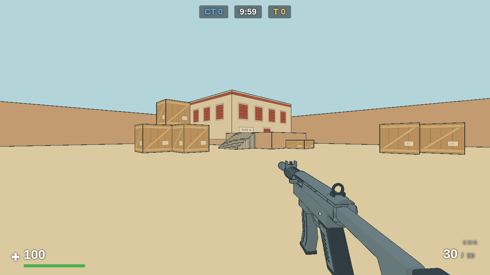 | 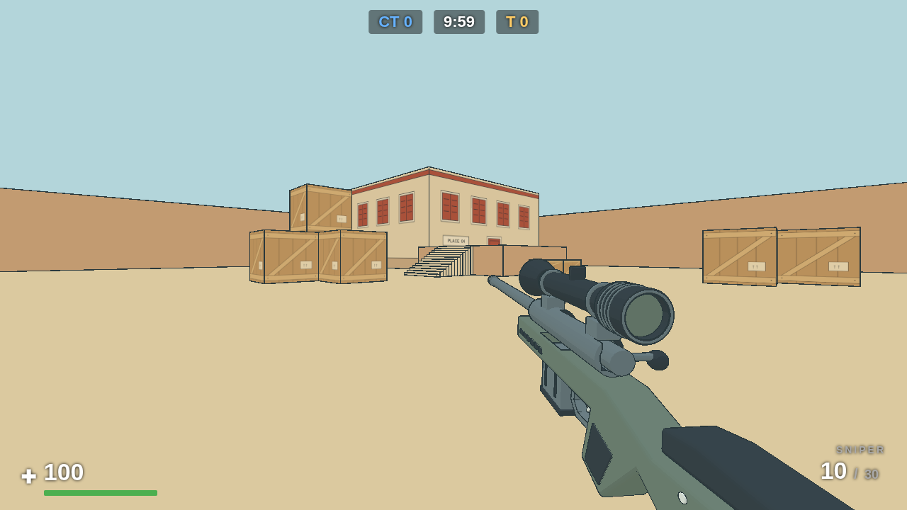 | 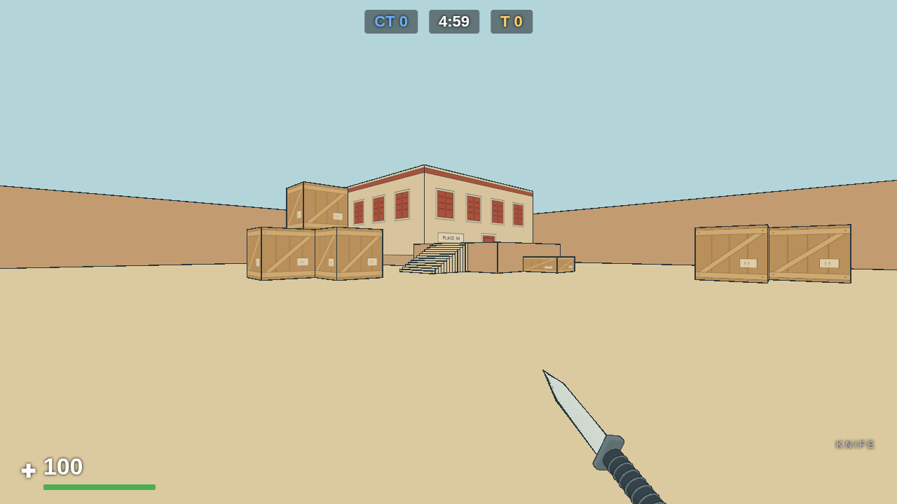 |

The rifle reload roll keeps the extracted magazines visible:

| SMG reload | Sniper reload |
| --- | --- |
| 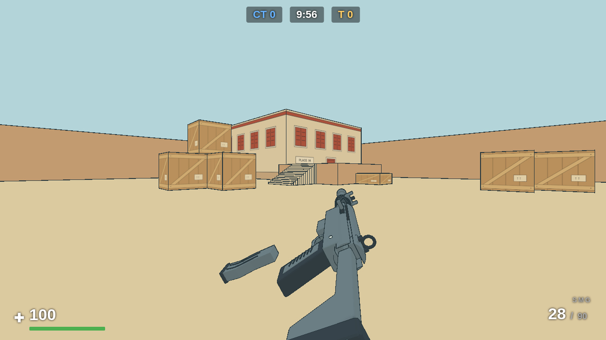 | 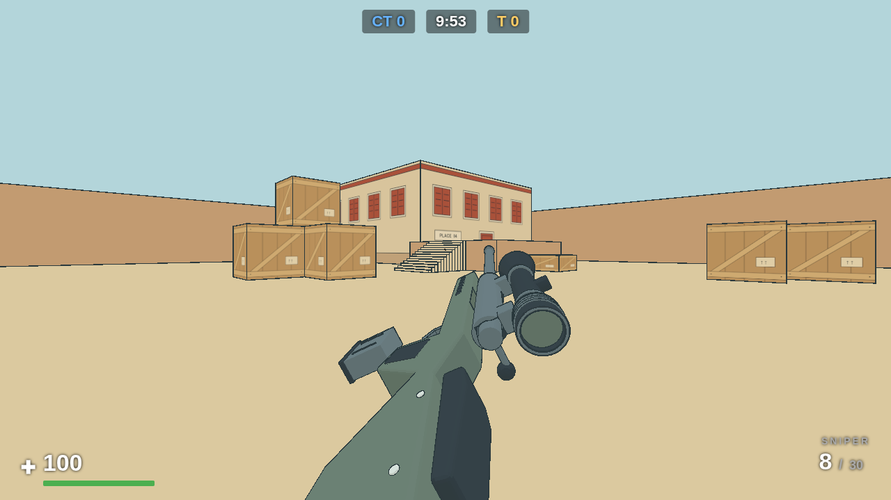 |


## AK-47

The AK-47 is a primary for the player and either bot team, including mixed
loadouts. It fires fully automatically at 600 RPM with 30/90 ammunition and a
2.5-second magazine reload. Damage is 30 torso, 60 head and 22.5 legs: two
headshots kill a fresh 100-HP target. Tighter rested accuracy than the SMG is
balanced by stronger climb and sideways recoil; existing defaults are unchanged.

`create-ak47-preview.py` generates only `assets/source/ak47.blend`, using the
shared modeling helpers without regenerating other weapons. Its wood stock,
curved front magazine, gas tube and right charging handle form a conventional
AK silhouette. The source validates 101 magazine and action positions against
receiver geometry. The simplified straight magazine extraction uses the existing
rifle reload roll; empty reloads rack the action after seating. Gameplay clocks
remain authoritative. Rear-notch clearance and the front sight crest at the
centre of ADS are checked through the full firing cycle.

```sh
ALSOFT_DRIVERS=null blender --background --factory-startup --python-exit-code 1 --python scripts/assets/create-ak47-preview.py
npm run assets:export
npm run assets:check
CS_SMOKE_BASE=http://127.0.0.1:5197 node scripts/ak47-check.mjs /tmp/ak47-review
CS_SMOKE_BASE=http://127.0.0.1:5197 node scripts/weapon-animation-check.mjs /tmp/ak47-review ak47
```

The AK integration check uses real picker input, persisted selection, hitscan
headshots, held-trigger cadence, recoil across swapping, and both bot teams'
GLB mounts. It also runs against production preview. Animation checks wait
through the complete draw delay before testing reload input.

| Hip | Iron sights |
| --- | --- |
| 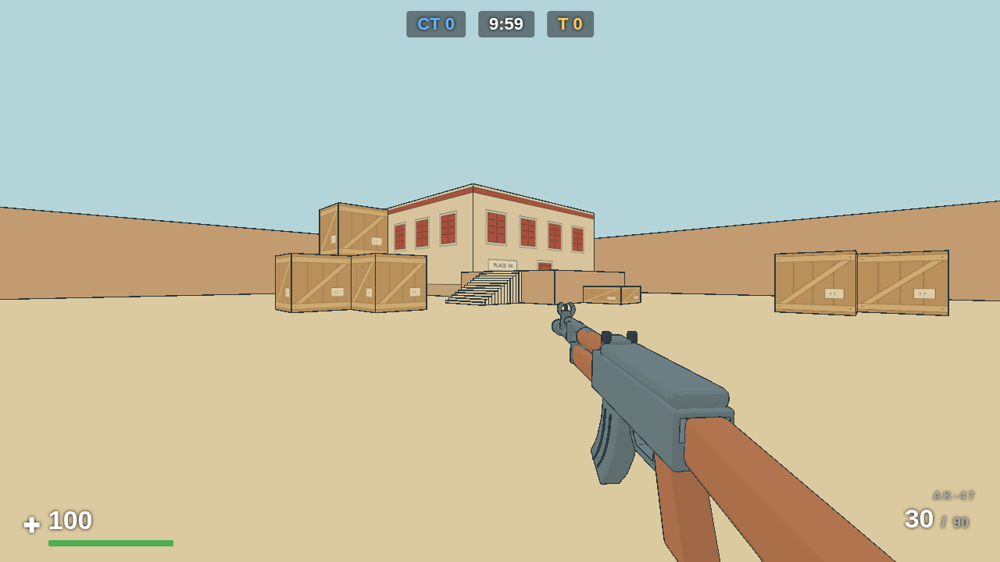 | 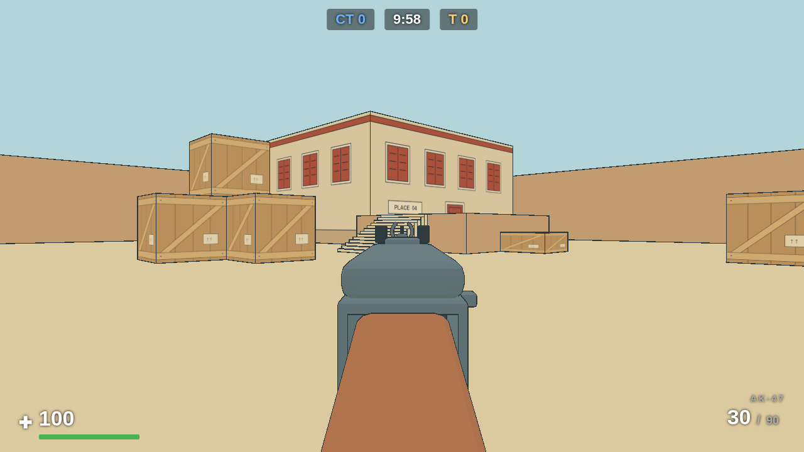 |

| Magazine extraction | Bot-held model |
| --- | --- |
| 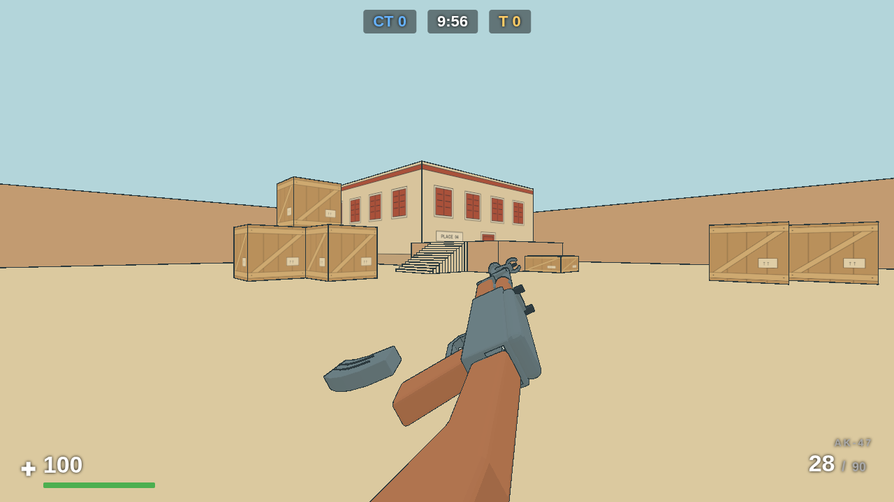 | 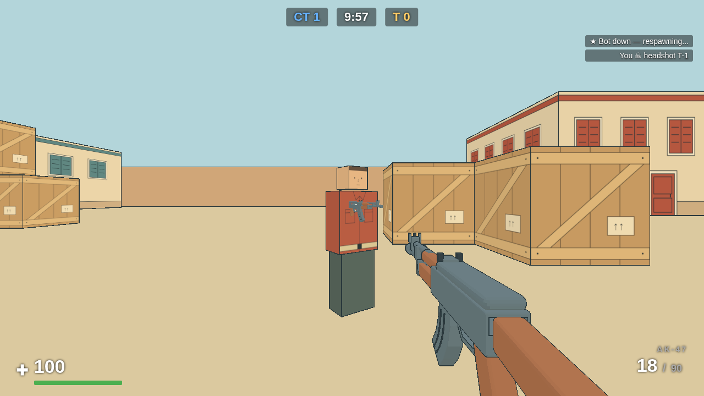 |

## Sawn-off double-barrel

`SAWN-OFF` (`sawnOff`) is a secondary for the player and both bot teams,
including mixed sidearm pools. Each click fires one of two shells; RMB aims.
Eight pellets deal 13 torso damage each, with a fixed 0.10-radian pattern,
a 0.25-second firing ceiling, and 16 reserve shells. ADS steadies the aim layer
without tightening the pellet pattern. The 2.4-second break-action reload
transfers only missing shells, together on completion, including partial and
limited-reserve reloads. Sprinting or swapping cancels without transferring ammo.

The dedicated generator overwrites only `sawnOff.blend`. Short bored barrels,
a walnut birdshead grip and fore-end, and a supported brass bead use the existing
palette. `mechanism_hinge` owns both chambers, the support grip, loading marker
and muzzle. The first-person reload extracts spent shells and feeds the available
replacement count along the rotated bore axes. Cancellation hides loose shells
and closes the hinge; bots use the same authored model and hinged action.
Gameplay clocks remain authoritative, including synthesized reload cues.

Bots retain deliberate single-shot pacing: a 1.4–1.8-second pause keeps their
preferred-range damage inside the existing budget. Their preferred range is
1–4 metres, with pellet hit probability reaching zero at 6.72 metres.

```sh
ALSOFT_DRIVERS=null blender --background --factory-startup --python-exit-code 1 --python scripts/assets/create-sawn-off-preview.py
npm run assets:export
npm run assets:check
CS_SMOKE_BASE=http://127.0.0.1:5199 node scripts/sawn-off-check.mjs /tmp/sawn-off-review
CS_SMOKE_BASE=http://127.0.0.1:5199 node scripts/weapon-animation-check.mjs /tmp/sawn-off-review sawnOff
```

The integration check covers actual picker input and persistence, both bot teams'
secondary mounts, eight-pellet hitscan damage, held-trigger suppression, empty-fire
reload, full/partial/limited-reserve transfers, ADS/fire refusal during reload,
sprint/swap cancellation, respawn and range ammunition. Run both browser commands
against production preview as well.

| Hip | Bead sights | Break-action reload |
| --- | --- | --- |
| 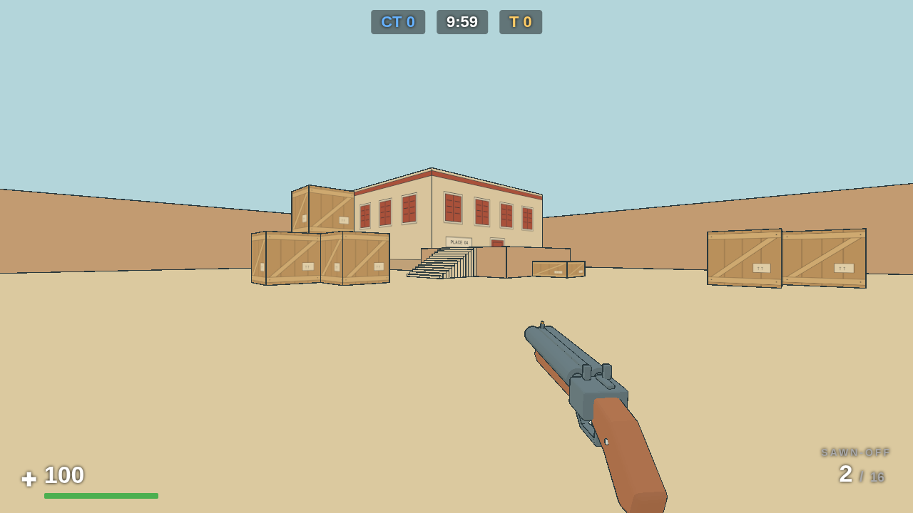 | 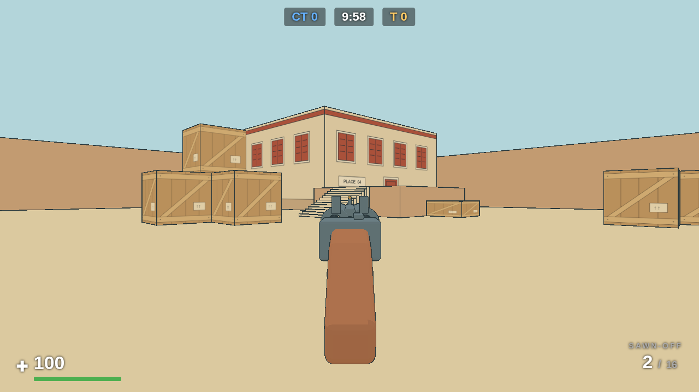 | 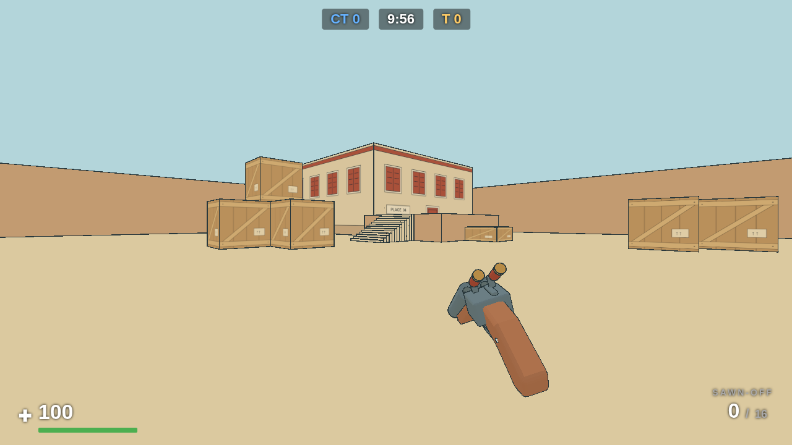 |

## Longbow

`scripts/assets/create-longbow.py` generates `longbow.blend` (it overwrites the
source, like the other generators):

```sh
ALSOFT_DRIVERS=null blender --background --factory-startup --python-exit-code 1 --python scripts/assets/create-longbow.py
npm run assets:export
```

A self yew English war bow at brace: 1.82 m nock to nock (1.91 m over the horn
nocks), a 0.17 m brace height, and a D-section stave, with a pale sapwood back
toward the target and a heartwood belly toward the archer. Unlike the guns it
stands upright, so its length is its height and `weaponRig.test.mjs` measures
y rather than z. The origin is the arrow pass. The stave sits 20 mm to its right,
as it does in a right-handed archer's bow hand.

The contract is its own:

- `grip_right` and `Muzzle` (the arrow pass) are fixed at the root. There is
  no `grip_left` or `reload_port`: nothing loads through a port.
- `mechanism_limbUpper` and `mechanism_limbLower` pivot at the ends of the
  rigid handle, so the draw can flex them. The leather wrap hides the lower
  joint and a horn arrow plate caps the upper one.
- `string_top` and `string_bottom` mark the nock grooves. Each is a child of
  its limb, so the flex carries it.

Only the stave is authored. The string and the nocked arrow move with the draw
every frame (`core/bowPresentation.ts`), and loosed arrows fly as world entities
(`arrows.ts`). All three are built in code (`core/arrowModel.ts`, the
cartridge pattern above). The bow is player-only, so it has no bot mount.

## Arming sword

`scripts/assets/create-arming-sword.py` generates `armingSword.blend`:

```sh
ALSOFT_DRIVERS=null blender --background --factory-startup --python-exit-code 1 --python scripts/assets/create-arming-sword.py
npm run assets:export
```

An Oakeshott type XII knightly sword, 0.93 m overall. It has a 0.76 m blade
of lozenge section with a fuller down its first two thirds, tapering to a
thrusting point; a straight 0.20 m cross; a leather-wrapped grip and a wheel
pommel. The grip's centre is the origin and the blade points down -z, with
the edges along y. The contract is the knife's: `grip_right` and `blade_tip`
are fixed at the root, and there are no mechanisms. `weaponAssets.ts` and
`weapon-pipeline.mjs` treat both blades with one test.

In first person it is held in a plow guard (`weaponModels.ts`). The hilt sits
low right and the point is aimed at the crosshair 2.5 m out, so the blade
frames a target without covering it. The LMB thrust reuses the knife's jab,
driven 0.30 m. The RMB slash rotates the blade about the grip
(`core/swordPresentation.ts`), from high right to low left across the frame.
It is player-only, so it has no bot mount.

